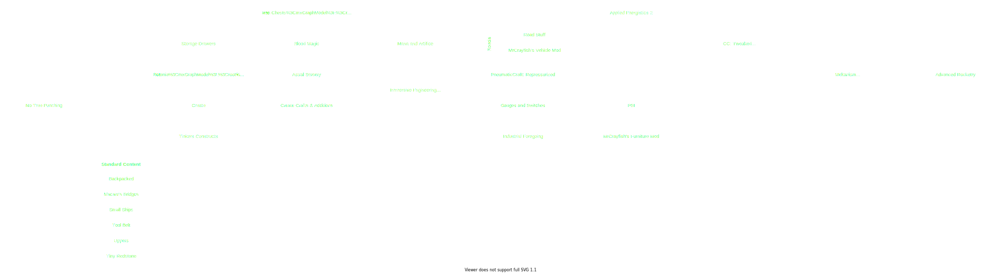

# Fabricage 0.1.2

__Modpack-Progress: [##########\_\_\_\_\_\_\_\_\_\_] ca. 50%__

## TODO
- [ ] test memmory usage
- [ ] set default options
- [ ] change icon
- [ ] change mainmenu

## MainMods
- [ ] [Advanced Peripherals (by Sr_endi)](https://www.curseforge.com/minecraft/mc-mods/advanced-peripherals)
- [ ] [Advanced Rocketry (by zmaster587)](https://www.curseforge.com/minecraft/mc-mods/advanced-rocketry)
- [x] [Applied Energistics 2 (by AlgorithmX2)](https://www.curseforge.com/minecraft/mc-mods/applied-energistics-2)
- [x] [Astral Sorcery (by HellFirePvP)](https://www.curseforge.com/minecraft/mc-mods/astral-sorcery)
- [x] [Backpacked (by MrCrayfish)](https://www.curseforge.com/minecraft/mc-mods/backpacked)
- [x] [Blood Magic  (by WayofTime)](https://www.curseforge.com/minecraft/mc-mods/blood-magic)
- [x] [Botania (by Vazkii)](https://www.curseforge.com/minecraft/mc-mods/botania)
- [ ] [CC: Tweaked (by SquidDev)](https://www.curseforge.com/minecraft/mc-mods/cc-tweaked)
- [x] [Create (by simibubi)](https://www.curseforge.com/minecraft/mc-mods/create)
- [x] [Create Crafts & Additions (by MRHminer)](https://www.curseforge.com/minecraft/mc-mods/createaddition)
- [x] [Engineer's Decor (by wilechaote)](https://www.curseforge.com/minecraft/mc-mods/engineers-decor)
- [ ] [Gauges and Switches (by wilechaote)](https://www.curseforge.com/minecraft/mc-mods/redstone-gauges-and-switches)
- [x] [Immersive Engineering (by BluSunrize)](https://www.curseforge.com/minecraft/mc-mods/immersive-engineering)
- [x] [Immersive Petroleum (by Flaxbeard)](https://www.curseforge.com/minecraft/mc-mods/immersive-petroleum)
- [x] [Immersive Posts (by TwistedGate)](https://www.curseforge.com/minecraft/mc-mods/immersiveposts)
- [ ] [Industrial Foregoing (by Buuz135)](https://www.curseforge.com/minecraft/mc-mods/industrial-foregoing)
- [x] [Iron Chests (by ProgWML6)](https://www.curseforge.com/minecraft/mc-mods/iron-chests)
- [x] [Macaw's Bridges (by sketch_macaw)](https://www.curseforge.com/minecraft/mc-mods/macaws-bridges)
- [x] [Mana and Artifice (by AWildCanadianEh)](https://www.curseforge.com/minecraft/mc-mods/mana-and-artifice)
- [ ] [Mekanism (by bradyaidanc)](https://www.curseforge.com/minecraft/mc-mods/mekanism)
- [ ] [Mekanism Generators (by bradyaidanc)](https://www.curseforge.com/minecraft/mc-mods/mekanism-generators)
- [ ] [MrCrayfish's Furniture Mod (by MrCrayfish)](https://www.curseforge.com/minecraft/mc-mods/mrcrayfish-furniture-mod)
- [x] [MrCrayfish's Vehicle Mod (by MrCrayfish)](https://www.curseforge.com/minecraft/mc-mods/mrcrayfishs-vehicle-mod)
- [x] [No Tree Punching (by AlcatrazEscapee)](https://www.curseforge.com/minecraft/mc-mods/no-tree-punching)
- [x] [PneumaticCraft: Repressurized (by desht_08)](https://www.curseforge.com/minecraft/mc-mods/pneumaticcraft-repressurized)
- [ ] [Psi (by Vazkii)](https://www.curseforge.com/minecraft/mc-mods/psi)
- [x] [Road Stuff (by Mapper)](https://www.curseforge.com/minecraft/mc-mods/road-stuff)
- [x] [Small Ships (by talhanation)](https://www.curseforge.com/minecraft/mc-mods/small-ships)
- [x] [Storage Drawers (by Texelsaur)](https://www.curseforge.com/minecraft/mc-mods/storage-drawers)
- [x] [Tinkers Construct (by mDiyo)](https://www.curseforge.com/minecraft/mc-mods/tinkers-construct)
- [ ] [Tiny Redstone (by Danny_and_Son)](https://www.curseforge.com/minecraft/mc-mods/tiny-redstone)
- [x] [Tool Belt (by gigaherz)](https://www.curseforge.com/minecraft/mc-mods/tool-belt)
- [x] [Uppers (by vadis365)](https://www.curseforge.com/minecraft/mc-mods/uppers)
  

Extranote:

The Guidebook "Sanguine Scientiem" from Bloodmagic has some issue, because of changs of the recipes. 
The book can't show some recipes, we can't fix it because of missing commands and missing
opportunity to change the recipe ID in the Guidebook. 
Also we can't recreate the original recipe ID because of Crafttweaks.
